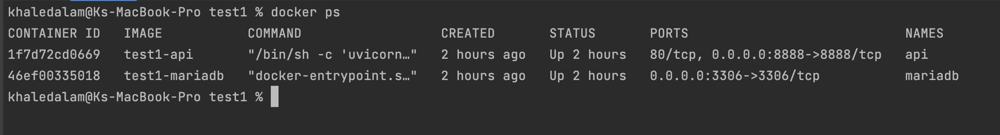
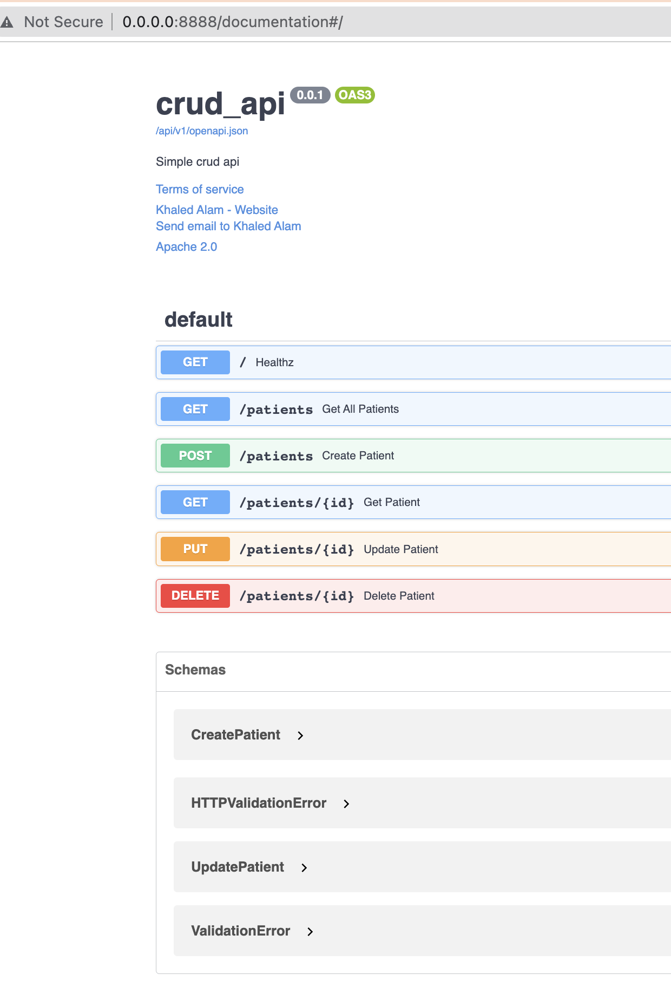
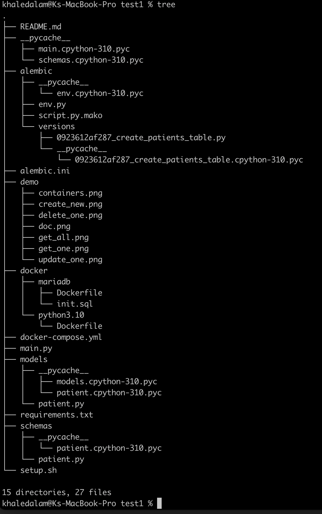
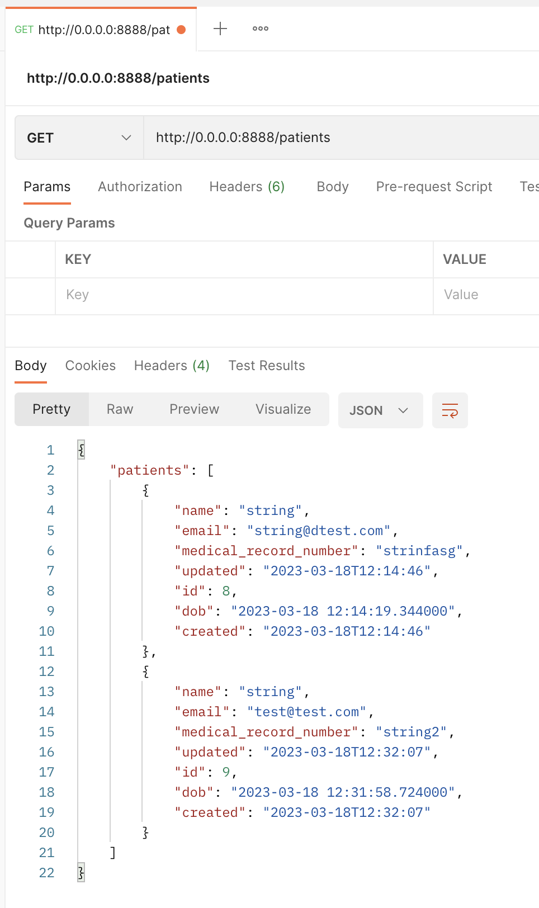
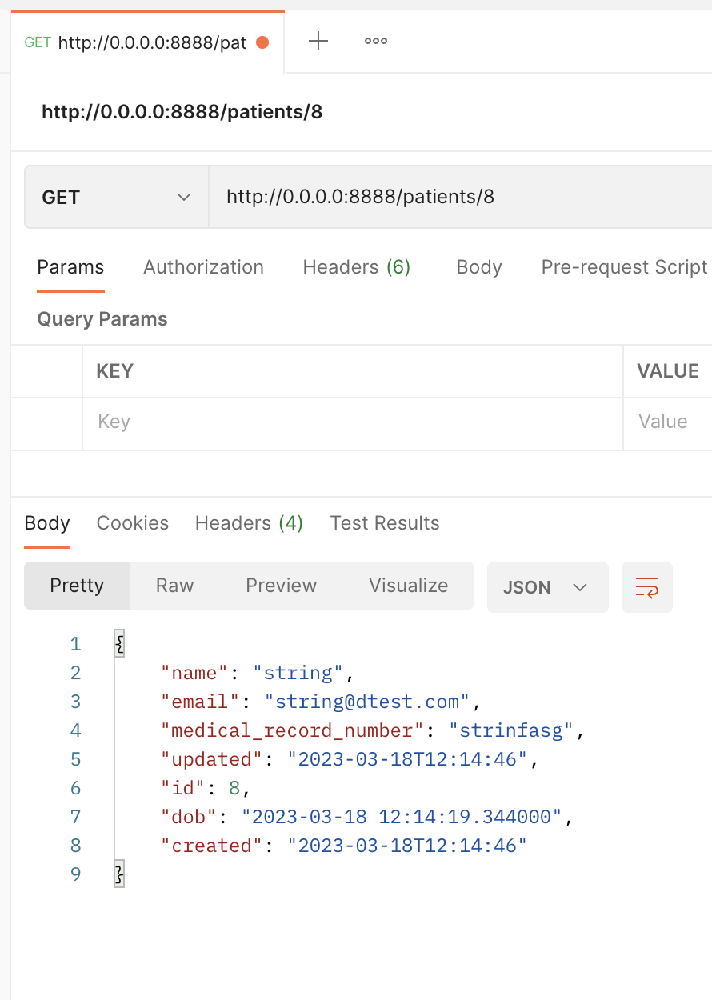
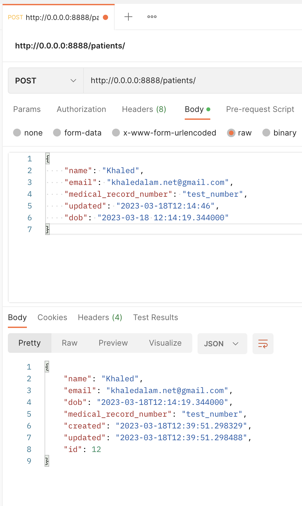
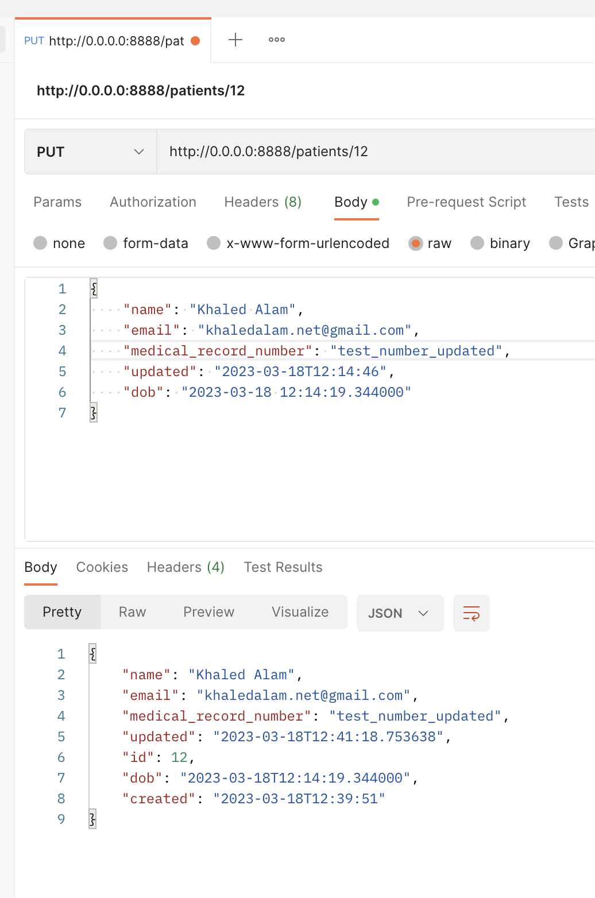
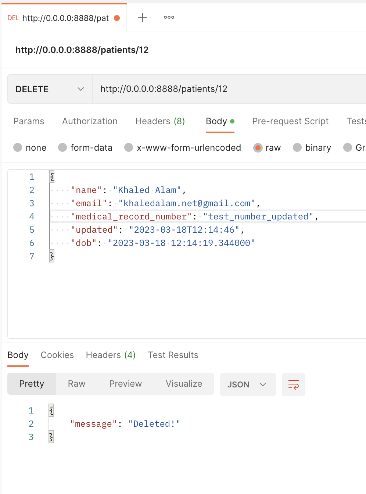

# For coding assignment purpose.

## Simple CRUD APIs
#### No middlewares, security, logging, validations(except email) handled.

### Requirements
- Docker and docker-compose `apt install docker.io docker-compose`
- Make sure 8888 and 3306 ports are not in use.

### Run 
1. Env & run containers: `./setup.sh` 
2. Migration: `docker exec -it api alembic upgrade head`

Ping to validate setup is done correctly: 
```curl
curl -X 'GET'  'http://0.0.0.0:8888/' -H 'accept: application/json'
```

### URLs
- Documentation: http://0.0.0.0:8888/documentation
- Re-Documentation: http://0.0.0.0:8888/re-documentation
- Openapi.json: http://0.0.0.0:8888/openapi.json

### Demo
Containers<br><br>
Docs<br><br>
Structure<br><br>
#### Postman APIs:
1. Get all<br>
2. Get one<br>
3. Create new<br>
4. Update one<br>
5. Delete one<br>

